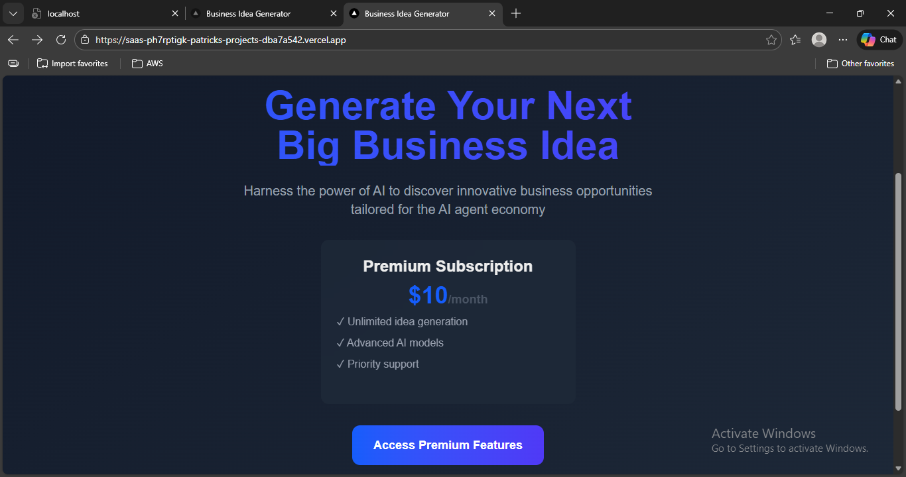
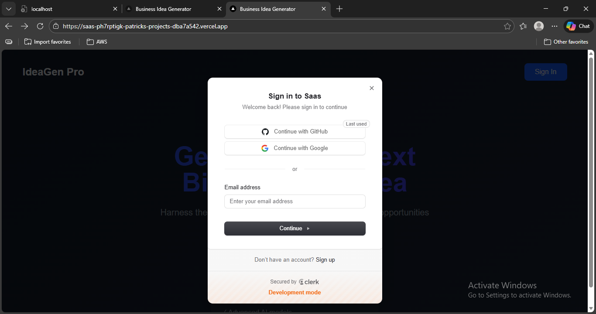
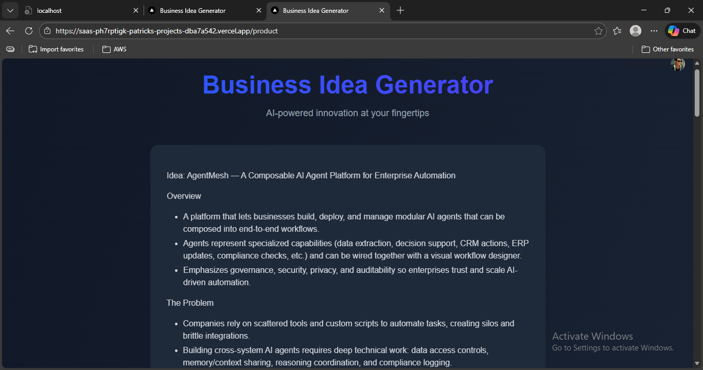

AI SaaS Application - Business Idea Generator

## ✨ Features Preview

### 1. **Landing Page**
Modern gradient design with authentication options

### 2. **Authentication Flow**
Seamless sign-in with multiple providers

### 3. **Product-page**
Real-time streaming responses with Markdown rendering

### 3. **Subscription**

Overview
A full-stack AI-powered SaaS application that generates innovative business ideas using OpenAI's GPT models. This application features a modern Next.js frontend, a FastAPI backend, real-time streaming responses, professional authentication with Clerk, and subscription management.
✨ Features

    🤖 AI-Powered Idea Generation: Utilizes OpenAI GPT models to generate creative business ideas for the AI agent economy

    ⚡ Real-Time Streaming: Server-Sent Events (SSE) for live, character-by-character response streaming

    🎨 Beautiful Markdown Rendering: Renders formatted content with headings, bullet points, and structured text

    🔐 Professional Authentication: User authentication via Clerk with support for Google, GitHub, and email login

    💰 Subscription Management: Integrated billing system with premium subscription tiers

    🌙 Dark Mode Support: Fully responsive design with dark/light mode compatibility

    🚀 Production Ready: Deployed on Vercel with optimized performance

🏗️ Technology Stack
Frontend

    Next.js 13+ with Pages Router

    TypeScript for type safety

    Tailwind CSS with Typography plugin for styling

    React Markdown for content rendering

    Clerk for authentication and billing

Backend

    FastAPI (Python) for API server

    OpenAI API for AI generation

    FastAPI Clerk Auth for JWT verification

Deployment

    Vercel for hosting and serverless functions

    Clerk Billing for payment processing

🚀 Quick Start
Prerequisites

    Node.js 18+ and npm

    Python 3.9+

    Vercel CLI installed

    OpenAI API key

    Clerk account (for authentication)

Installation

    Clone the repository

bash

git clone https://github.com/Patrickmbaza/AI-SAAS-APPLICATION.git
cd AI-SAAS-APPLICATION

    Install frontend dependencies

bash

npm install

    Install backend dependencies

bash

pip install -r requirements.txt

    Set up environment variables
    Create a .env.local file in the root directory:

env

NEXT_PUBLIC_CLERK_PUBLISHABLE_KEY=your_publishable_key_here
CLERK_SECRET_KEY=your_secret_key_here
CLERK_JWKS_URL=your_jwks_url_here
OPENAI_API_KEY=your_openai_api_key

    Configure Clerk

        Create an account at clerk.com

        Create a new application with authentication providers

        Enable billing and create a subscription plan with key premium_subscription

        Copy your API keys and JWKS URL to the environment variables

🏃 Running Locally
Development Server

    Start the development server

bash

npm run dev
# or
vercel dev

    Open http://localhost:3000 in your browser

Building for Production
bash

npm run build
npm start

📁 Project Structure
text

AI-SAAS-APPLICATION/
├── api/
│   └── index.py              # FastAPI backend with streaming endpoints
├── pages/
│   ├── _app.tsx             # Next.js app wrapper with Clerk provider
│   ├── _document.tsx        # Custom document structure
│   ├── index.tsx            # Landing page with authentication
│   └── product.tsx          # Protected product page with subscription check
├── styles/
│   └── globals.css          # Global styles with Tailwind
├── public/                  # Static assets
├── package.json            # Frontend dependencies
├── requirements.txt        # Backend dependencies
└── vercel.json            # Vercel configuration

🔧 Configuration
Vercel Environment Variables

Add the following to your Vercel project:
bash

vercel env add NEXT_PUBLIC_CLERK_PUBLISHABLE_KEY
vercel env add CLERK_SECRET_KEY
vercel env add CLERK_JWKS_URL
vercel env add OPENAI_API_KEY

Clerk Setup

    Authentication Providers: Enable Google, GitHub, and Email authentication

    Subscription Plan: Create a plan with key premium_subscription

    Billing: Configure payment gateway (Clerk's built-in or Stripe)

🌐 Deployment
Deploy to Vercel

    Link your project

bash

vercel link

    Deploy to preview

bash

vercel

    Deploy to production

bash

vercel --prod

Custom Domain (Optional)

    In Vercel Dashboard, go to your project → Settings → Domains

    Add your custom domain and follow DNS configuration steps

🔐 Authentication Flow

    User visits landing page → Sees sign-in options

    User signs in → Clerk handles authentication and creates JWT

    User accesses product → Subscription status is checked

    API requests → JWT token sent to FastAPI for verification

    Subscription required → Non-subscribers see pricing table

💳 Subscription Management
Plan Configuration

    Plan Key: premium_subscription

    Price: $10/month (configurable in Clerk Dashboard)

    Features: Unlimited AI idea generation

User Subscription Flow

    Unauthenticated user → Redirected to sign-in

    Authenticated, no subscription → Sees pricing table

    User subscribes → Clerk handles payment

    Active subscriber → Access to idea generator

🛠️ API Endpoints
Backend (FastAPI)

    GET /api - Streams AI-generated business ideas

        Requires: JWT authentication header

        Response: Server-Sent Events stream

        Format: Markdown-formatted text

Authentication

    All API requests require Authorization: Bearer <jwt_token> header

    JWT tokens are automatically provided by Clerk after sign-in

🎨 Styling & UI
Tailwind Configuration

    Uses Tailwind CSS with utility-first classes

    Typography plugin for beautiful Markdown rendering

    Dark mode with dark: prefix classes

    Gradient backgrounds and glassmorphism effects

Components

    Landing Page: Hero section with authentication CTA

    Product Page: Protected page with idea generator

    User Menu: Profile management and subscription access

    Pricing Table: Clerk-managed subscription plans display

🔄 Real-Time Streaming
Server-Sent Events (SSE)

    Frontend: Uses EventSource or fetchEventSource for streaming

    Backend: FastAPI StreamingResponse with OpenAI stream

    Format: Line-by-line Markdown transmission

    Benefits: Instant feedback, no waiting for complete response

Markdown Processing

    React Markdown with GFM (GitHub Flavored Markdown) support

    Remark plugins for enhanced parsing

    Custom CSS for consistent styling

🚦 Testing
Local Testing
bash

# Test frontend
npm run dev

# Test authentication flow
# Requires Clerk environment variables

Production Testing

    Deploy to Vercel preview

    Test sign-up and authentication

    Test subscription flow (test payments)

    Test idea generation with API

🐛 Troubleshooting
Common Issues

    "Module not found" errors
    bash

rm -rf node_modules
npm install

    Authentication errors

        Verify Clerk environment variables are set

        Check JWT token in browser console

        Ensure JWKS URL is correct

    Streaming not working

        Check browser console for SSE errors

        Verify OpenAI API key has credits

        Ensure backend is running correctly

    Subscription issues

        Verify plan key is premium_subscription

        Check Clerk billing configuration

        Clear browser cache and cookies

Vercel Deployment Issues

    Check Vercel build logs for errors

    Verify all environment variables are set

    Ensure Python runtime is selected for API folder

📈 Monitoring & Analytics
Recommended Tools

    Vercel Analytics: Built-in performance monitoring

    Clerk Dashboard: User authentication analytics

    OpenAI Usage Dashboard: API usage and costs

Logging

    Frontend errors logged to browser console

    Backend errors in Vercel function logs

    Authentication logs in Clerk dashboard

🔮 Future Enhancements
Planned Features

    Multiple AI Models: Choice of GPT-4, Claude, or custom models

    Idea Categories: Filter by industry, investment level, or risk

    Collaboration Features: Share and collaborate on ideas

    Export Options: Export ideas as PDF, Markdown, or Notion

    Admin Dashboard: Manage users, subscriptions, and usage

Technical Improvements

    Database Integration: Store generated ideas and user preferences

    Caching Layer: Redis for faster response times

    Rate Limiting: Protect API from abuse

    Webhook Integration: Real-time updates for subscription changes

🤝 Contributing

    Fork the repository

    Create a feature branch

    Make your changes

    Test thoroughly

    Submit a pull request

Development Guidelines

    Follow TypeScript best practices

    Maintain consistent styling with Tailwind

    Add appropriate error handling

    Update documentation as needed

📄 License

This project is licensed under the MIT License - see the LICENSE file for details.
🙏 Acknowledgments

    OpenAI for GPT API access

    Clerk for authentication and billing

    Vercel for hosting and deployment

    Tailwind CSS for styling framework

📞 Support

For issues, questions, or contributions:

    GitHub Issues: Report a bug or request a feature

    Email: [Your contact email]

    Documentation: Check the Wiki for detailed guides

Built with ❤️ for entrepreneurs and innovators. Generate your next big idea today!
